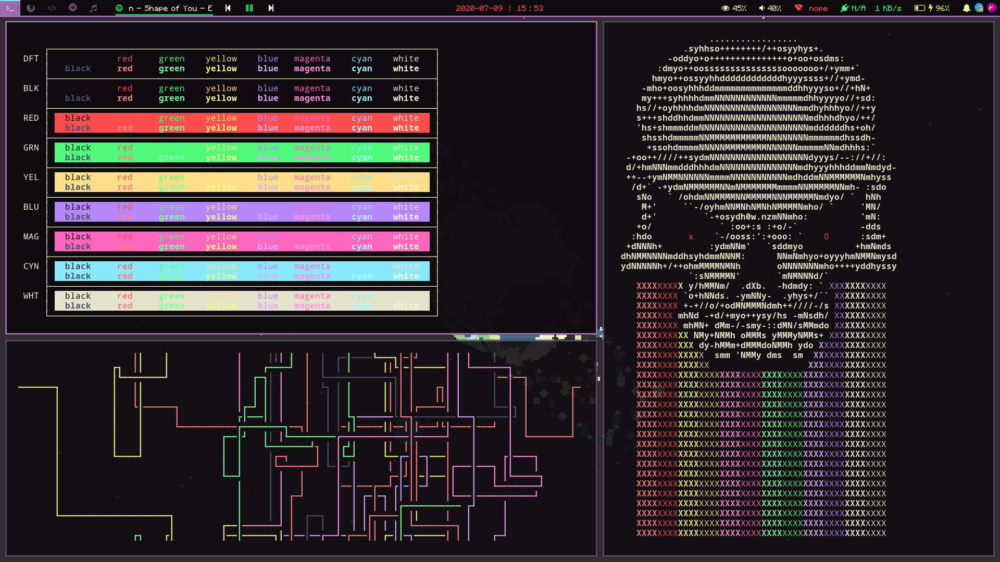

# Dracula-V
The dracula theme with a violet tint

## Dracula-V Palette

| Palette           | Hex       | RGB                   | Preview                                                           |
| :---              | :---:     | :---                  | :---:                                                             |
| Background        | `#0e0b0f` | `rgb(41, 33, 44)`     |    |
| Current Line      | `#684b68` | `rgb(104, 75, 104)`   |    |
| Selection         | `#684b68` | `rgb(104, 75, 104)`   |    |
| Foreground        | `#f5f5d6` | `rgb(245, 245, 214)`  |    |
| Comment           | `#9d6aaf` | `rgb(157, 106, 175)`  |    |
| Black             | `#100a10` | `rgb(16, 10, 16)`     |    |
| Dark Grey         | `#4a5169` | `rgb(74, 81, 105)`    |    |
| Light Grey        | `#e4e4cd` | `rgb(228, 228, 205)`  |    |
| Red               | `#ff4d4d` | `rgb(255, 77, 77)`    |    |
| Light Red         | `#ff8080` | `rgb(255, 128, 128)`  |    |
| Green             | `#50fa7b` | `rgb(80, 250, 123)`   |    |
| Light Green       | `#83fba1` | `rgb(131, 251, 161)`  |    |
| Brown             | `#fcdf88` | `rgb(252, 223, 136)`  |    |
| Yellow            | `#f0fa85` | `rgb(240, 250, 133)`  |    |
| Blue              | `#b687f8` | `rgb(182, 135, 248)`  |    |
| Light Blue        | `#d6acff` | `rgb(214, 172, 255)`  |    |
| Magenta           | `#ff66bd` | `rgb(255, 102, 189)`  |    |
| Light Magenta     | `#ff92df` | `rgb(255, 146, 223)`  |    |
| Pink              | `#ff79c6` | `rgb(255, 121, 198)`  |    |
| Cyan              | `#8be9fd` | `rgb(139, 233, 253)`  |    |
| Light Cyan        | `#a4ffff` | `rgb(164, 255, 255)`  |    |
| Purple            | `#bd93f9` | `rgb(189, 147, 249)`  |    |
| Orange            | `#ffb86c` | `rgb(255, 184, 108)`  |    |

## Dracula Palette for comparison

Palette      | Hex       | RGB           | HSL             | 
---          | ---       | ---           | ---             | ---
Background   | `#282a36` | `40 42 54`    | `231° 15% 18%`  | 
Current Line | `#44475a` | `68 71 90`    | `232° 14% 31%`  | 
Selection    | `#44475a` | `68 71 90`    | `232° 14% 31%`  | 
Foreground   | `#f8f8f2` | `248 248 242` | `60° 30% 96%`   | 
Comment      | `#6272a4` | `98 114 164`  | `225° 27% 51%`  | 
Cyan         | `#8be9fd` | `139 233 253` | `191° 97% 77%`  | 
Green        | `#50fa7b` | `80 250 123`  | `135° 94% 65%`  | 
Orange       | `#ffb86c` | `255 184 108` | `31° 100% 71%`  | 
Pink         | `#ff79c6` | `255 121 198` | `326° 100% 74%` | 
Purple       | `#bd93f9` | `189 147 249` | `265° 89% 78%`  | 
Red          | `#ff5555` | `255 85 85`   | `0° 100% 67%`   | 
Yellow       | `#f1fa8c` | `241 250 140` | `65° 92% 76%`   | 